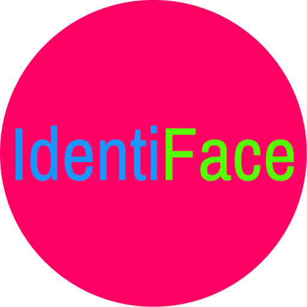

# IdentiFace
This is a project made at HackUCII. [Here is the devpost.](https://devpost.com/software/hackuciiproject)

### Inspiration
The idea was born when the developers, during prom and their high school graduation, realized how much of a hassle it was to send pictures to all the people they took pictures with. So they decided to make an Android application to do it for them.

### What does it do?
The user first chooses photos from the phone that he or she wants to share. IdentiFace will detect the faces in each photo and compare it to people that it has already seen and stored. Any unidentified faces will result in a new person with unknown contact information, and the user will have the option to create a new contact with that person. There will be options for IdentiFace to send all of the photos that a person is in to that person through email, MMS text, or Facebook Messenger.

### How was it made?
The app was built in Android Studio, written with gradle, Java, and XML. Also, API calls are made to Microsoft Azure's Face API for face detection and identification.

### What's next?
Batch upload capability, full sharing functionality through MMS texting and Facebook Messages.

